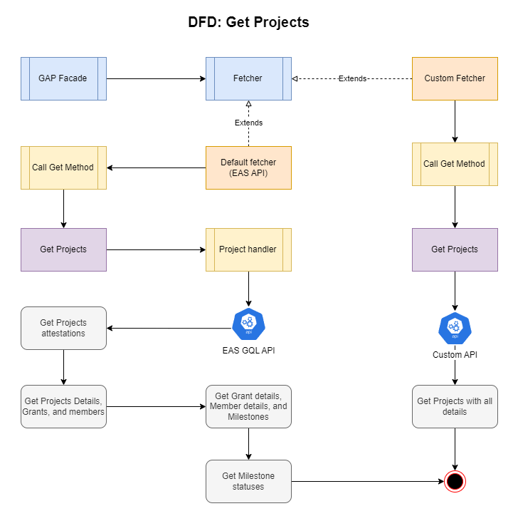
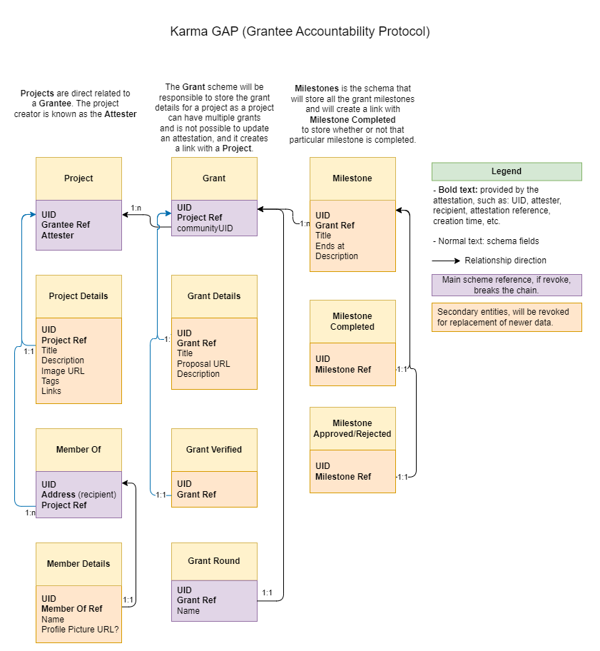

# Karma GAP SDK

## Summary

1. [What is GAP SDK?](#1-what-is-gap-sdk)
2. [Architecture](#2-architecture)
3. [Getting started](#3-getting-started)
4. [Fetching Entities](#4-getting-attestations)
5. [Creating entities in the Frontend](#5-attesting-data-in-a-frontend)
6. [Creating entities in the Backend](#6-attesting-data-in-a-backend)
7. [Gasless transactions with Gelato](#7-gasless-transactions-with-gelato)
8. [Speed up requests with a Custom API](#8-custom-api)

## 1. What is GAP SDK?

The GAP SDK is a library for easy integration with [Grantee Accountability Protocol](https://gap.karmahq.xyz). Using this library, you will be able to:

- Fetch and display Communities, Projects, Members, Grants, Milestones, and all of their dependencies.
- Create, update and delete all of the above.
- Utilize gasless transactions with [Gelato Relay](https://relay.gelato.network).
- Utilize custom API endpoints to speed up queries instead of accessing data onchain through RPC end points.

## 2. Architecture

The GAP SDK is module-based and adheres to specific parameters to ensure organization and ease of maintenance. At its core, the SDK is divided into the following modules:

1. **GAP Facade**: This object is responsible for centralizing resources within the SDK, providing all the tools and methods required to retrieve attestations from the network and convert them into concrete objects for display, attestation, modification, and revocation. The GAP Facade includes the `fetcher` module and stores all the necessary settings for the instance.

2. **Attestations**: The attestation module is versatile and can accommodate various types of attestations available at [EAS](https://attest.sh). It can also be inherited to cater to specific attestation types, such as a Project, for example. This generic object is capable of performing attestations and revocations through the `Schema` module.

3. **Schemas**: The Schema is an **abstract module** that assumes the responsibility of establishing a connection with the EAS infrastructure. This class contains all the parameters, methods, and interactions needed to communicate with the blockchain.

4. **Entities**: An entity represents a specific attestation `type` customized to fulfill specific requirements, such as data processing prior to attestation or method overrides. An entity always extends the `Attestation` module and inherits all its features.

5. **Contract**: To meet the requirements of this SDK, a custom intermediary contract is utilized to add an abstraction layer to the original EAS contracts. This is essential for a better user experience, reduced gas costs, and monitoring. Karma's GAP SDK employs a special contract for this purpose. For more information, please refer to the [Gap Contracts](https://github.com/show-karma/gap-contracts) repository.

6. **Fetcher**: This **abstract module** is responsible for interacting with EAS or a custom API to retrieve attestations and transform them into instances of `Attestation`. The `Fetcher` module is indispensable if a custom API is desired.

Here's an example of how all these modules work together when retrieving Projects:



In this diagram, you can already discern the benefits of using a Custom API to obtain data from the network and construct your own indexer, as opposed to relying on EAS's GraphQL API. We will delve into this further in [Section 8](#8-custom-api).

> **Note**: GAP currently does not fully support multichain, and creating more than one instance can result in unexpected errors when using the fetcher. This feature is currently under development.

### Attestations

All the data in the protocol is stored as attestations using [EAS](https://attest.sh). Attestations are categorized into various types of entities to establish a relationship between them and enable users to modify their attestation details without losing references to the main attestation. As a result, entities like community, project, grant, and members require two attestations: the first defines the entity, and the second defines its details. Due to this structure, all these entities will include a `details` property that contains all the data inserted into that attestation. For example:

```ts
import { Project } from '@show-karma/karma-gap-sdk';

export function printProjectDetails(project: Project) {
  console.log({
    title: project.details?.title,
    imageURL: project.details?.imageURL,
    description: project.details?.description,
  });
}
```

This example can be applied to all the entities in the diagram below, each of which has its own interface and details parameters.

> When effectively using this SDK, you may notice differences between the data listed in the diagram and the actual entity. This discrepancy arises from the need to structure our classes to facilitate the use of certain parameters, such as `Grant.communities`, which is not included in the diagram. The diagram only encompasses attestation data, and some data is added during runtime and is not part of the on-chain attestation.



## 3. Getting started

After setting up your project, install GAP SDK with `yarn` or `npm`:

`$ yarn add karma-gap-sdk`

`$ npm i karma-gap-sdk`

After installing, you can instantiante GAP:

```ts
// gap.client.ts;
import { GAP } from '@show-karma/karma-gap-sdk';

const gap = GAP.createClient({
  network: 'optimism-goerli', // sepolia, optimism,
  // apiClient: custom api client, see Section 8;
  // gelatoOpts: for gasless transactions, see Section 7;
});

export default gap;
```

The `GAP.createClient` serves as a factory for creating a client's singleton, and you should always use it unless you require multiple clients.

> Please note that the need for multiple clients arises primarily when using the default EAS API client, as it offers distinct endpoints for various networks. If you're utilizing a custom API, you can implement methods to filter by network and prevent client mutation.

The `apiClient` option is employed when you wish to use a Custom API. The SDK provides a standard custom API that can be initiated with `apiClient: GapIndexerClient(url)`. However, it's also possible to develop your own API in any programming language and data modeling and utilize it as your client. To achieve this, create your class and extend the abstract class `Fetcher`:

```ts
// MyCustomApiClient.ts
import { Fetcher } from '@show-karma/karma-gap-sdk/core/class/Fetcher';

export class MyCustomApiClient extends Fetcher {
  // ... implement all Fetcher methods following its return types and arguments.
}
```

[..] Then you can use it on GapClient. More details about how to implement a custom fetcher on [Section 8](#8-custom-api).

```ts
// gap.client.ts;
import { GAP } from '@show-karma/karma-gap-sdk';
import { MyCustomApiClient } from './MyCustomApiClient.ts';

const gap = GAP.createClient({
  network: 'optimism-goerli', // sepolia, optimism,
  apiClient: new MyCustomApiClient('https://my-custom-api.mydomain.com'),
  // gelatoOpts: for gasless transactions, see it on Chap. 7;
});

export default gap;
```

The `gelatoOpts` option is used when developers aim to provide gasless transactions for a better user experience. For more details about this feature, please refer to [Chapter 7](#7-gasless-transactions-with-gelato).

## 4. Fetching Entities

After initializing the GAP client, you are now able to fetch entities available including:

- Communities
- Projects
- Grants
- Grant updates
- Members of Projects
- Milestones
- Milestone updates

Indeed, you can retrieve all available entities, but we provide methods primarily for the higher-level entities, as this aligns with the intended behavior. When examining the `Fetcher` interface, you can:

- Retrieve communities along with their related grants.
- Obtain projects, which will contain related members and grants. Note that grants will include related updates and milestones, and milestones will also include their updates.
- Fetch grants for grantees.
- Retrieve projects from grantees.
- Access milestones associated with a grant.
- Get members of a project.

To begin using the fetcher, simply call `gap.fetch.<target>(...args)` as demonstrated in the following example:

```ts
import { gap } from './gap-client';

gap.fetch.projects().then((res) => {
  res.forEach((project) => {
    console.log(project.details.title);
  });
});

gap.fetch
  .projectBySlug('my-project-slug')
  .then((project) => {
    console.log(project.details.name);
  })
  .catch((er) => {
    console.error(er.message);
  });
```

## 5. Creating entities in the Frontend

Creating entities (by adding attestations) using the GAP SDK is quite straightforward. Developers only need to define what they want to attest, and we provide facilities for this module. To avoid frequent wallet pop-ups for individual entity attestations, we've developed a special contract that handles multiple attestations and their relationships. This means you can transact once and attest multiple times. Let's walk through an example:

Suppose a user wants to create a project, and this project will include:

1. Its details (title, image, and description).
2. Two members.
3. A grant.
4. The grant will have one milestone.

> To attest a grant, it will require a community, so consider that a community already exists. To create a community, the user needs to go through [this link](https://tally.so/r/wd0jeq).

After setting up the GAP client, you can proceed to:

```ts
// get-dummy-project.ts
import {
  Project,
  ProjectDetails,
  MemberOf,
  Grant,
  GapSchema,
} from '@show-karma/karma-gap-sdk';

export function getDummyProject() {
  // Creating Project
  const project = new Project({
    data: { project: true },
    schema: GapSchema.find('Project'),
    // Owner address, usually whoever is connected to the app
    recipient: '0xd7d...25f2',
  });

  // Adding details to the project
  project.details = new ProjectDetails({
    data: {
      title: 'My Project',
      description: 'My Description',
      imageURL: 'https://loremflickr.com/320/240/kitten',
      links: [{ type: 'github', url: 'https://github.com/my-org' }],
      tags: [{ name: 'DAO' }, { name: 'UI/UX' }],
    },
    schema: GapSchema.find('ProjectDetails'),
    recipient: project.recipient,
  });

  const member_1 = new MemberOf({
    data: { memberOf: true },
    schema: GapSchema.find('MemberOf'),
    refUID: pro.uid,
    // member 1 address
    recipient: '0x8dC...A8b4',
  });

  const member_2 = new MemberOf({
    data: { memberOf: true },
    schema: GapSchema.find('MemberOf'),
    refUID: pro.uid,
    // member 2 address
    recipient: '0xabc...A7b3',
  });

  // Add members to the project
  project.members.push(member_1, member_2);

  // Creating Grant
  const grant = new Grant({
    // Address of the related community
    data: { communityUID: '0xabc...def' },
    schema: GapSchema.find('Grant'),
    recipient: project.recipient,
  });

  // Adding details to Grant
  grant.details = new GrantDetails({
    data: {
      title: 'Build the Gap App',
      proposalURL: 'https://pantera.com/',
      description: 'Grant Description',
      // cycle: grant cycle, optional
      // season: grant season, optional
    },
    schema: GapSchema.find('GrantDetails'),
    recipient: pro.recipient,
  });

  // Creating milestone
  const milestone = new Milestone({
    data: {
      title: 'Build the Home Page',
      description: 'Milestone Description',
      endsAt: Date.now() + 1000000,
    },
    schema: GapSchema.find('Milestone'),
    recipient: pro.recipient,
  });

  grant.milestones.push(milestone);

  // Add grants to the project
  project.grants.push(grant);

  return project;
}
```

Once you have set up the project with all its dependencies, it's time to attest. You can do this by calling `project.attest` and providing a signer to sign the transaction. The `signer` can be an ethers.js wallet or a Web3.js provider, as long as it satisfies the `SignerOrProvider` interface. In some cases, the EAS API may indicate that these providers do not perfectly match the signer's interface, but in most cases, this can be easily resolved by using `any` typing.

```ts
// useSigner.ts

// wagmi/react example
import { useWalletClient } from 'wagmi';

export function walletClientToSigner(walletClient: WalletClient) {
  const { account, chain, transport } = walletClient;
  const network = {
    chainId: chain.id,
    name: chain.name,
    ensAddress: chain.contracts?.ensRegistry?.address,
  };
  const provider = new providers.Web3Provider(transport, network);
  const signer = provider.getSigner(account.address);

  return signer;
}

export function useSigner() {
  const { data: walletClient } = useWalletClient();

  const [signer, setSigner] = useState<JsonRpcSigner | undefined>(undefined);
  useEffect(() => {
    async function getSigner() {
      if (!walletClient) return;

      const tmpSigner = walletClientToSigner(walletClient);

      setSigner(tmpSigner);
    }

    getSigner();
  }, [walletClient]);
  return signer;
}
```

Then, in the attestation file:

```ts
import { getDummyProject } from 'util/get-dummy-project';
import { useSigner } from 'util/useSigner';

export const MyComponent: React.FC = () => {
  const signer = useSigner();

  const attestProject = async () => {
    const project = getDummyProject();
    // any typing is required here as it
    // does not naturally fits the EAS
    // SignerOrProvider interface.
    await project.attest(signer as any);
    console.log(
      `Attested Project ${project.details.title} with uid ${project.uid}`
    );
  };
};
```

The previous example is related to when a user wishes to attest a project with all its relationships, but it's not mandatory to follow the same method. It's entirely possible to transact separate attestations using the refUID property for each attestation. As an example, let's say the user wants to add another grant to the project:

```ts
// add-grant-to-project.ts
import { Grant, GrantDetails, GapSchema, Hex } from '@show-karma/karma-gap-sdk';

export function addGrantToProject(
  grant: IGrantDetails,
  communityUID: Hex,
  recipient: Hex,
  projectUID: Hex
): Grant {
  const grant = new Grant({
    data: { communityUID },
    schema: GapSchema.find('Grant'),
    recipient,
    // The ref UID will create a reference from
    // the current grant to an already attested
    // project
    refUID: projectUID,
  });

  return grant;
}
```

So using the last example, we can get:

```ts
import { getDummyProject } from 'util/get-dummy-project';
import { addGrantToProject } from 'util/add-grant-to-project';
import { Project } from '@show-karma/karma-gap-sdk';

export const MyComponent: React.FC = () => {
  const signer = useSigner();
  const [project, setProject] = useState<Project>()

  const attestProject = async () => {
    const project = getDummyProject();
    // any typing is required here as it
    // does not naturally fits the EAS
    // SignerOrProvider interface.
    await project.attest(signer as any);
    setProject(project);
    console.log(
      `Attested Project ${project.details.title} with uid ${project.uid}`
    );
  };

  const addGrant = () => {
    if(!project) throw new Error('No project set up.');

    const grant = addGrantToProject(
        {
            title: 'Grant 2',
            description: 'Grant 2 description',
            proposalURL: 'https://example.com'
        },
        communityUID: '0xa...bcde',
        recipient: project.recipient,
        projectUID: project.uid
    );

    await grant.attest(signer as any);
    project.grants.push(grant);
    console.log(`Grant ${grant.details.title} attested with uid ${grant.uid}`)
  };
};
```

> This approach can be applied to any subsequent attestation, whether it's adding a milestone to a grant, a grant to a project, members to a project, or updating Project, Grant, and Community details. It's also available when approving, rejecting, or completing a milestone. If any of these operations are performed multiple times, the latest one will take precedence.

Following any type of attestation, the SDK will associate UIDs with the objects, making them accessible after the attestation is completed. For instance, if you perform the project attestation with all its dependents, you can retrieve the attestation UID of the project, its details, grants, milestones, and so on.

### Deleting an entity

Since every object returned by the Fetcher is also an Attestation, to delete an entitye, you just have to revoke the attestation by calling attestation.revoke.

```ts
// revoke-project.ts
import { SignerOrProvider, Project } from '@show-karma/karma-gap-sdk';

export async function revokeProject(
  project: Project,
  signer: SignerOrProvider
) {
  await project.revoke(signer);
}
```

### Updating details

To update the details of a Community, Project, or Grant, simply replace the current details and attest again.

```ts
// update-project-details.ts
import {
  SignerOrProvider,
  Project,
  IProjectDetails,
  ProjectDetails,
  GapSchema,
} from '@show-karma/karma-gap-sdk';

export async function updateProjectDetails(
  project: Project,
  data: IProjectDetails,
  signer: SignerOrProvider
) {
  // If project details already exists:
  project.details.setValues(data);

  // and if they not, we need to instantiate
  // project.details = new ProjectDetails({
  //   data,
  //   recipient: project.recipient,
  //   schema: GapSchema.find('ProjectDetails'),
  // });

  await project.details.attest(signer);
  console.log(`Project ${project.details.name} was updated.`);

  // You can return the project or not. As it is a reference to
  // the original project, the details will be updated
  // in the previous instance.
  return project;
}
```

> Note that you cannot update Milestone without losing all of its references.

## 6. Create entities in a Backend

To create entities in the backend, follow the same content as provided in [Section 5](#5-attesting-data-in-a-frontend). The only distinction between them is that in the backend, you'll need to instantiate an `ethers.js` wallet at runtime to sign attestations.

```ts
import { gap } from 'gap-client';
import { getDummyProject } from 'util/get-dummy-project';

// Create the web3 provider
const web3 = new ethers.providers.JsonRpcProvider(
  'https://my-provider-url.com'
);

// Creating a ethersjs wallet
const wallet = new ethers.Wallet('0xabc...def1', web3);

const project = getDummyProject();

project.attest(wallet as any).then(() => {
  // After attesting, project.uid should be filled.
  console.log(
    `Project ${project.details.name} attested with uid ${project.uid}`
  );
});
```

## 7. Gasless Transactions with Gelato

Gasless transactions are an excellent option when a developer aims to enhance the user experience and attestation flow. In this SDK, we leverage [Gelato Relay](https://relay.gelato.network) to sponsor transactions, eliminating the need for users to cover network fees\*.

> \* Currently, this feature is available for all attestations except milestone completion/approvals/rejection updates. Gasless support for these specific attestations is under development and may be released soon.

Before using gasless transactions, it's essential to visit the [Gelato Relay](https://relay.gelato.network) app, set up and fund your account on one of the available networks (e.g., optimism goerli, sepolia, or optimism mainnet), configure the contract, and obtain your API key.

> The ABI for our contract can be found [here](https://github.com/show-karma/karma-gap-sdk/blob/dev/core/abi/MultiAttester.json).

> For the security of your Gelato account, only enable gasless transactions for the `multiSequentialAttest`, `attest`, and `multiRevoke` methods.

Continuing with how to use gasless transactions, developers will encounter the following options when creating a GAP instance:

````ts
interface GAPArgs {
  // ... Other GAP client constructor arguments
  /**
   * Defined if the transactions will be gasless or not.
   *
   * In case of true, the transactions will be sent through [Gelato](https://gelato.network)
   * and an API key is needed.
   *
   * > __Note that to safely transact through Gelato, the user must
   * have set a handlerUrl and not expose gelato api in the frontend.__
   */
  gelatoOpts?: {
    /**
     * Endpoint in which the transaction will be sent.
     * A custom endpoint will ensure that the transaction will be sent through Gelato
     * and api keys won't be exposed in the frontend.
     *
     * __If coding a backend, you can use `apiKey` prop instead.__
     *
     * `core/utils/gelato/sponsor-handler.ts` is a base handler that can be used
     * together with NextJS API routes.
     *
     * @example
     *
     * ```ts
     * // pages/api/gelato.ts
     * import { handler as sponsorHandler } from "core/utils/gelato/sponsor-handler";
     *
     * export default const handler(req, res) => sponsorHandler(req, res, "GELATO_API_KEY_ENV_VARIABLE");
     *
     * ```
     */
    sponsorUrl?: string;
    /**
     * If true, env_gelatoApiKey will be marked as required.
     * This means that the endpoint at sponsorUrl is contained in this application.
     *
     * E.g. Next.JS api route.
     */
    contained?: boolean;
    /**
     * The env key of gelato api key that will be used in the handler.
     *
     * @example
     *
     * ```
     * // .env
     * GELATO_API_KEY=1234567890
     *
     * // sponsor-handler.ts
     *
     * export async function handler(req, res) {
     *  // ...code
     *
     *  const { env_gelatoApiKey } = GAP.gelatoOpts;
     *
     *  // Will be used to get the key from environment.
     *  const { [env_gelatoApiKey]: apiKey } = process.env;
     *
     *  // send txn
     *  // res.send(result);
     * }
     * ```
     */
    env_gelatoApiKey?: string;
    /**
     * API key to be used in the handler.
     *
     * @deprecated Use this only if you have no option of setting a backend, next/nuxt api route
     * or if this application is a backend.
     *
     * > __This will expose the api key if used in the frontend.__
     */
    apiKey?: string;
    /**
     * If true, will use gelato to send transactions.
     */
    useGasless?: boolean;
  };
}
````

If `gasless` transactions are required, developers should be aware that it can be used in three modes, all of which require setting `gelatoOpts.useGasless: true`:

1. **With API Key:**
   This method is recommended when used in an external API. If utilized at the frontend level, the API key becomes visible to all users. To implement this method, simply fill in `gelatoOpts.apiKey: '<gelato api key>'`. Please note that a deprecation warning will appear with this disclaimer, but rest assured, this option will not be removed from the SDK. The constructor will appear as follows:

```ts
GAP.createClient({
    network: 'optimism-goerli',
    gelatoOpts: {
        apiKey: '<GELATO_API_KEY>'
        // to use gasless. it can be mutated
        // through GAP.useGasless = <boolval>
        useGasless: true
    }
})
```

2. **With External API Support:**
   In this scenario, you're using an external API, such as your indexer, to provide a sponsored transaction URL that communicates with Gelato. Here, the API key will not be visible. To use this method, simply provide the `gelatoOpts.sponsorUrl`.

```ts
GAP.createClient({
    network: 'optimism-goerli',
    gelatoOpts: {
        sponsorUrl: 'https://my-api.mydomain.com/sponsor-url-name'
        // to use gasless. it can be mutated
        // through GAP.useGasless = <boolval>
        useGasless: true
    }
})
```

3. **With Self-Contained API Support:**
   This case is similar to #2, but the difference is that you're using a self-contained API, such as Next.js API, which doesn't require an external backend to request the transaction. In this case, you will need to provide:

```ts
GAP.createClient({
  network: 'optimism-goerli',
  gelatoOpts: {
    sponsorUrl: '/api/my-contained-sponsor-url',
    // marking contained as required will make possible
    // to send transactions through a NextJS api.
    contained: true,
    // to use gasless. it can be mutated
    // through GAP.useGasless = <boolval>
    useGasless: true,
  },
});
```

When using a self-contained API to hide API keys, we offer a plug-and-play utility for Next.js. You can utilize it by importing `import { handler } from karma-gap-sdk` and placing it under `/pages/api/sponsored-txn.ts`.

```ts
// pages/api/sponsored-handler.ts
import { type ApiRequest, handler as sponsorTxnHandler } from '@show-karma/karma-gap-sdk';
import type { NextApiResponse } from 'next';

const handler = (req: ApiRequest, res: NextApiResponse) =>
  sponsorTxnHandler(req as ApiRequest, res, 'NEXT_GELATO_API_KEY');

export default handler;
```

> Please note that `NEXT_GELATO_API_KEY` is not an actual API key but the name of the environment variable to retrieve from `process.env`. This setup will not expose the API key in the frontend. Your `.env` file should contain a field like `NEXT_GELATO_API_KEY=abcdefg123`. For more details, refer to [sponsor-handler.ts L63](https://github.com/show-karma/karma-gap-sdk/blob/f2f3f863c8b2b475ca74bd76bb9290a075c12f60/core/utils/gelato/sponsor-handler.ts#L63).

After placing the API page, set `gelatoOpts.sponsorUrl: '/api/sponsored-txn'`, and all transactions will be routed through the Gelato Relay network.

### External API

When using an external API to facilitate gasless transactions, you'll need to create an endpoint with a structure similar to the example below:

```ts
// gelato/sponsor-handler.ts
import { GelatoRelay } from '@gelatonetwork/relay-sdk';
import { Gelato } from '@show-karma/karma-gap-sdk/core/utils/gelato/';
// Exception Handler available under your development.
import { HttpException } from '../error/HttpException';

export type SponsoredCall = [
  {
    data: string;
    chainId: string;
    target: string;
  },
  string,
  {
    retries: number;
  },
];

const assertionObj = [
  {
    data: /0x[a-fA-F0-9]+/gim,
    chainId: /\d+/,
    target: /0x[a-fA-F0-9]{40}/gim,
  },
  /\{apiKey\}/,
  {
    retries: /\d+/,
  },
];

function assert(body: any): body is Parameters<GelatoRelay['sponsoredCall']> {
  if (!Array.isArray(body) || body.length !== assertionObj.length)
    throw new HttpException('Invalid request body: wrong length.', 400);

  assertionObj.forEach((item, index) => {
    // check if objects from assertion Object are present in body
    // and test them using the regexp from the assertion Object
    if (typeof item === 'object') {
      Object.entries(item).forEach(([key, value]) => {
        if (!body[index][key]?.toString().match(value))
          throw new HttpException(
            `Invalid request body: ${value} doesn't match body[${index}][${key}].`,
            400
          );
      });
    }
    // test other items as strings
    else if (!body[index]?.toString().match(item))
      throw new HttpException(
        `Invalid request body: ${item} doesn't match body[${index}].`,
        400
      );
  });

  return true;
}

async function sendTransaction(payload: SponsoredCall) {
  try {
    if (!assert(payload)) return;

    const { GELATO_API_KEY: apiKey } = process.env;
    if (!apiKey) throw new Error('Api key not provided.');

    payload[1] = apiKey;

    const [request, sponsorApiKey, options] = payload;

    const result = await Gelato.sendByApiKey(request, sponsorApiKey, options);
    const txId = await result.wait();

    return { txId, chainId: request.chainId };
    // eslint-disable-next-line @typescript-eslint/no-explicit-any
  } catch (error: any) {
    throw new HttpException(error.message, 400); // Bad Request
  }
}

const gelato = {
  sendTransaction,
};

export { gelato };
```

> If you wish to customize this example, please note that the transaction body must adhere to the format of the SponsoredCall interface, as this interface represents the required arguments in the EAS contract call.

After setting up a custom endpoint, the constructor in your frontend app will appear as follows:

```ts
GAP.createClient({
    network: 'optimism-goerli',
    gelatoOpts: {
        sponsorUrl: 'https://my-api.mydomain.xyz/path/to/sponsored-txn'
        // to use gasless. it can be mutated
        // through GAP.useGasless = <boolval>
        useGasless: true
    }
})
```

These are all the settings needed to enable gasless transactions with the GAP SDK, and from this point forward, users should not be required to pay for gas.

> Please note that with this option, you will cover the gas fees through Gelato.

## 8. Custom API

The SDK offers two methods for fetching data from the network:

1. Using the [EAS GraphQL API](https://optimism-goerli-bedrock.easscan.org/graphql).
2. Using a custom-made API.

When using the default EAS provider, users can access all the features offered by the SDK. However, it may lead to slow response times. This is because of the architectural limitations of the EAS API, as discussed in [Chapter 2](#2-architecture). The EAS API architecture doesn't support relationships between attestations, which necessitates multiple calls to retrieve the desired result, such as a project with all its dependents.

To address this issue, the SDK includes the `Fetcher` module, allowing developers to create their own service and integrate it with the SDK. Integration is achieved by extending the fetcher API and implementing its methods. If you are not going to use a specific method or if your service does not support it, you should implement an error handler or return an empty response.

You can review the Fetcher interface in [this file](https://github.com/show-karma/karma-gap-sdk/blob/dev/core/class/Fetcher.ts).

```ts
// my-fetcher.ts
import { Fetcher } from '@show-karma/karma-gap-sdk/core/class/Fetcher.ts';
import { Attestation } from '@show-karma/karma-gap-sdk';

const Endpoints = {
  projects: {
    byIdOrSlug: (uid: Hex) => `/projects/${uidOrSlug}`,
  },
};

export class MyFetcher extends Fetcher {
  projectById(uid: `0x${string}`): Promise<Project> {
    // Note that the Fetcher class extends an axios utility class
    // and provides a client for performing http requests
    // by calling this.client
    const project = await this.client.get(
      Endpoints.projects.byIdOrSlug(uid) /* ,{...axiosOpts} */
    );

    if (!data) throw new Error('Attestation not found');
    // You need to return a Project instance
    return Project.from([data])[0];
  }

  async projects(name?: string): Promise<Project[]> {
    const { data } = await this.client.get<Project[]>(Endpoints.project.all(), {
      params: {
        'filter[title]': name,
      },
    });

    return Project.from(data);
  }
  // ... other methods
}
```

> You can check a functional example [here](https://github.com/show-karma/karma-gap-sdk/blob/dev/core/class/karma-indexer/GapIndexerClient.ts).

After implementing your own client, you can setup the GAP client:

```ts
// gap.client.ts;
import { GAP } from '@show-karma/karma-gap-sdk';
import { MyFetcher } from './MyFetcher';

const gap = GAP.createClient({
  network: 'optimism-goerli', // sepolia, optimism,
  // Use your client here
  apiClient: new MyFetcher('https://my-api.mydomain.com'),
});

export default gap;
```

> Note that your API service should return data that aligns with the interfaces provided by each Attestation for proper compatibility with this SDK. This ensures that the data is structured correctly to work seamlessly with the SDK.
